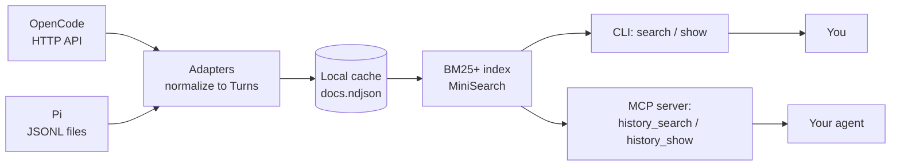

# session-search

**Search your own coding-agent history.** `session-search` reads local
[OpenCode](https://opencode.ai) and [Pi](https://pi.dev) sessions into a small
local index, so you (or your agent) can ask *"where did we solve this before?"*
without re-reading transcripts.

It works from the **CLI**, over **MCP**, or through a generated
**OpenCode plugin / Pi extension**.

```bash
npx session-search index
npx session-search search "the rate limiter we added"
```

> It indexes the signal and skips the noise: user/assistant text, reasoning,
> compaction summaries, and tool **inputs**. Tool **outputs**, file contents, and
> images are never indexed (they are ~87% of a typical history and mostly repo
> noise).

---

## Contents

- [Quick start](#quick-start)
- [Install](#install)
- [How it works](#how-it-works)
- [Commands](#commands)
- [Examples](#examples)
- [Use it from OpenCode](#use-it-from-opencode)
- [Use it from Pi](#use-it-from-pi)
- [MCP tools](#mcp-tools)
- [How ranking works](#how-ranking-works)
- [Evaluation](#evaluation)
- [Security & privacy](#security--privacy)
- [Cache & configuration](#cache--configuration)
- [Troubleshooting](#troubleshooting)
- [Compatibility](#compatibility)
- [Architecture](#architecture)
- [Releasing](#releasing)

---

## Quick start

```bash
# 1. Install (per project)
npm i -D https://github.com/faetschi-bot/faetschi-bot-utils/releases/download/session-search-latest/session-search.tgz

# 2. Check your setup (works even before you index)
npx session-search doctor --json

# 3. Build the index for the current project
npx session-search index

# 4. Search it
npx session-search search "database is locked"
```

No index yet? `search` tells you to run `index`. Re-running `index` is cheap: it
is **incremental** and skips anything unchanged.

---

## Install

### Per project (recommended)

```bash
npm i -D https://github.com/faetschi-bot/faetschi-bot-utils/releases/download/session-search-latest/session-search.tgz
npx session-search doctor --json     # require "ok": true
```

### Globally

```bash
npm i -g https://github.com/faetschi-bot/faetschi-bot-utils/releases/download/session-search-latest/session-search.tgz
session-search doctor --json
```

### Vendored copy or git submodule

```bash
# Vendored copy
cp -r session-search /path/to/project/tools/session-search
cd tools/session-search && npm install          # installs the runtime deps
node bin/session-search.mjs doctor

# Git submodule
git submodule add https://github.com/faetschi-bot/faetschi-bot-utils tools/faetschi-bot-utils
cd tools/faetschi-bot-utils/session-search && npm install
node bin/session-search.mjs doctor
```

> `session-search` has three small runtime dependencies (`minisearch`,
> `@modelcontextprotocol/server`, `zod`). `doctor` runs without them;
> `index`/`search`/`mcp` need `npm install` once. Installing the release tarball
> resolves them from the public npm registry automatically.

---

## How it works



1. **Adapters** read each harness: OpenCode over its local HTTP API, Pi from its
   JSONL session files.
2. Both are normalized into one **Turn** record
   (`{harness, project, session, parent, title, seq, time, role, kind, text, tool, input, refs}`).
3. Turns are **redacted and capped**, then written to a rebuildable **cache**.
4. **MiniSearch** builds a BM25+ index over the cached turns.
5. You search it from the **CLI** or an agent calls the **MCP server**.

Indexing is **incremental**: an OpenCode session whose `time.updated` is
unchanged, or a Pi file whose size/mtime are unchanged, reuses its previously
extracted turns.

---

## Commands

```text
session-search index [options]              read session history into the cache
session-search search "<query>" [options]   search the cached history
session-search show <sessionID> [options]   print one session's indexed turns
session-search doctor [options]             check Node, cache, and sources
session-search mcp                          run the MCP stdio server
session-search install [options]            install the OpenCode/Pi adapter
```

### Flags

| Flag | Applies to | Meaning |
|------|-----------|---------|
| `--harness <name>` | `index`, `search`, `show`, `install` | `opencode`, `pi`, or `all` (default `all`; `install` defaults to `opencode`) |
| `--project <dir>` | `index`, `search`, `show` | scope to sessions under this directory (default: cwd) |
| `--all` | `index`, `search`, `show` | use every project instead of the current one |
| `--limit <n>` | `search`, `show` | max results (search, default 10) or turns (show) |
| `--recency <0..1>` | `search` | weak recency boost (0 = off, default 0) |
| `--include-subagents` | `search` | keep child sessions instead of folding them into parents |
| `--pi-sessions <dir>` | `index` | Pi sessions directory |
| `--cache <dir>` | all | cache root (default: the platform cache dir) |
| `--no-redact` | `index` | do not redact secrets before writing the index |
| `--force` | `index` | rebuild even when the source fingerprint is unchanged |
| `--progress` | `index` | print progress to stderr |
| `--global` | `install` | install the adapter to the user-global location |
| `--dry-run` | `install` | report what would be installed |
| `--print` | `install` | print an MCP config snippet instead of writing a file |
| `--json` | all | print a machine-readable result |

Every command exits non-zero on failure, so scripts and CI can gate on it.

---

## Examples

### Search from the CLI

```bash
$ session-search search "rate limiter"
22.46  PROMPT: add a rate limiter to the API client  [opencode]
    …Add a RateLimiter token-bucket middleware keyed by API key; return 429 with Retry-After…
    session ses_f077ed5f…  assistant/action
```

Machine-readable:

```bash
$ session-search search "rate limiter" --json
{
  "ok": true,
  "query": "rate limiter",
  "scope": "project",
  "project": "/home/me/app",
  "sources": ["opencode"],
  "results": [
    {
      "harness": "opencode",
      "session": "ses_f077ed5f…",
      "title": "PROMPT: add a rate limiter to the API client",
      "project": "/home/me/app",
      "parent": null,
      "score": 22.459,
      "matched": 14,
      "snippet": "…add a rate limiter to the API client…",
      "match": { "role": "assistant", "kind": "reasoning", "time": 1790875609661, "seq": 1 }
    }
  ]
}
```

### Print a whole session

```bash
$ session-search show ses_f077ed5f… --limit 5
Rate limiter work  [opencode]
  user/text: add a rate limiter to the API client
  assistant/reasoning: The user wants a limiter for the export endpoint…
  assistant/text: Add a RateLimiter middleware keyed by API key…
```

### Narrow the scope

```bash
session-search index --harness opencode           # only OpenCode
session-search index --harness pi --project ~/work/api
session-search index --all --progress             # every project, with progress
session-search search "CORS" --include-subagents --limit 20
session-search search "docker image" --recency 0.3
```

### Check the environment

```bash
$ session-search doctor --json
{
  "ok": true,
  "version": "0.1.1",
  "checks": [
    { "name": "node",             "status": "ok",   "message": "Node 20.19.2" },
    { "name": "cache",            "status": "ok",   "message": "/home/me/.cache/session-search (mode 700)" },
    { "name": "opencode-source",  "status": "ok",   "message": "reachable at http://127.0.0.1:49374" },
    { "name": "pi-source",        "status": "skip", "message": "not detected on this machine" },
    { "name": "dependencies",     "status": "ok",   "message": "resolved minisearch, @modelcontextprotocol/server" },
    { "name": "redaction",        "status": "ok",   "message": "secret patterns redact correctly" },
    { "name": "scope",            "status": "ok",   "message": "default scope is the current project (use --all for every project)" },
    { "name": "index",            "status": "warn", "message": "no index yet; run `session-search index`" }
  ]
}
```

A missing harness is `skip`; an unreachable service, missing dependency, or
empty/stale index is `warn`; an unsupported index schema or unwritable cache is a
failure.

---

## Use it from OpenCode

Two ways — pick one.

### Option A: generated plugin (recommended)

```bash
npx session-search install --harness opencode
```

This writes `.opencode/plugins/session-search.js`, which:

- registers native **`history_search`** and **`history_show`** tools,
- adds a **`/history`** command,
- refreshes the index after a session goes idle.

Then just ask the agent: *"search our history for the CORS fix"*.

### Option B: MCP server only

```bash
npx session-search install --harness opencode --print   # show the snippet
# or configure it yourself:
```

```jsonc
// opencode.json
{
  "mcp": {
    "servers": {
      "session_search": {
        "type": "local",
        "command": ["node", "node_modules/session-search/bin/session-search.mjs", "mcp"],
        "codemode": false
      }
    }
  }
}
```

Then gate it if you like:

```jsonc
{ "permissions": [ { "action": "session_search_*", "resource": "*", "effect": "ask" } ] }
```

> OpenCode's `plugin add` does not accept tarballs, so the plugin is installed as
> a file. Under OpenCode's Code Mode, plugin-registered MCP servers connect but
> are not exposed to the model in v2.0.x, so the plugin registers native tools
> instead; a file-configured MCP server (Option B) is exposed and callable.

---

## Use it from Pi

```bash
npx session-search install --harness pi
```

This writes `.pi/extensions/session-search.ts`, which:

- registers the MCP server (`exposure: "direct"`) on `session_start`,
- adds a **`/history`** command,
- refreshes the index on `agent_settled`,
- warns if a third-party extension replaced Pi's built-in MCP,
- can require confirmation for its tools with `SESSION_SEARCH_REQUIRE_UI=1`.

Or configure MCP by hand (`pi mcp add` or `~/.pi/agent/mcp.json`):

```json
{ "mcpServers": { "session_search": {
  "command": "node",
  "args": ["node_modules/session-search/bin/session-search.mjs", "mcp"],
  "exposure": "direct"
} } }
```

Pi 1.0 ships built-in MCP, so no extra extension is needed.

---

## MCP tools

Both tools are read-only and return model text plus `structuredContent`.

### `history_search`

```jsonc
{
  "query": "rate limiter",        // required
  "scope": "project",             // "project" | "all" (default "project")
  "limit": 10,                    // 1..50
  "includeSubagents": false,
  "recency": 0                    // 0..1
}
```

Returns `{ query, scope, count, truncated, hits: [{ harness, session, title, project, parent, score, matched, snippet, match }] }`.

### `history_show`

```jsonc
{ "session": "ses_…", "limit": 20 }
```

Returns `{ session, count, truncated, turns: [{ role, kind, time, text }] }`.

When OpenCode invokes a tool it sends the calling session id in
`_meta["ai.opencode/sessionID"]`; the server uses it to scope results to that
session's project even when the server cwd differs. Pi does not send it, so
scope falls back to cwd.

---

## How ranking works

- **BM25+** via MiniSearch (`k1=1.2`, `b=0.7`, `d=0.5`). The `d` term
  lower-bounds term frequency so very long reasoning turns are not unfairly
  penalized.
- **Code-aware tokenizer**: emits the whole token plus camelCase / snake_case /
  letter-digit subtokens and path-suffix tokens, so `getUserById` and
  `user id` both match. No stemming.
- **Per-role field weights** (approximating BM25F):

  | Field | Boost |
  |-------|-------|
  | title | 3 |
  | user text | 2.5 |
  | assistant text | 1.5 |
  | path | 1.5 |
  | reasoning | 0.6 |
  | compaction / action / tool | 1 |

- **Structure-aware chunking**: long turns split on paragraphs/headings
  (~800 chars, 200 overlap) before scoring.
- **Session aggregation**: sum of the top 3 chunk scores plus a match bonus.
- **Subagent collapse**: child sessions fold into their parent unless they
  clearly outrank it (`--include-subagents` to keep them).
- **Optional recency**: `--recency 0..1` applies a weak 180-day half-life decay;
  off by default.

---

## Evaluation

Retrieval quality is gated in CI against a frozen, committed corpus — **no
network and no LLM at gate time**:

```bash
npm run eval          # fail if any category NDCG@10 drops >2 points vs baseline
npm run eval:update   # rewrite eval/baseline.json after an intended change
node eval/judge.mjs   # offline: print candidate pools for relabeling
```

Current baseline:

```text
NDCG@10  overall 0.9654  (recall@10 0.9792, mrr 0.9722)
  semantic   ndcg 0.9307  recall 0.9583  mrr 0.9444  (12 queries)
  symbol     ndcg 1  recall 1  mrr 1  (4 queries)
  path       ndcg 1  recall 1  mrr 1  (3 queries)
  command    ndcg 1  recall 1  mrr 1  (3 queries)
  temporal   ndcg 1  recall 1  mrr 1  (2 queries)
[eval] ok
```

- `eval/corpus/turns.jsonl` — 16 sanitized sessions.
- `eval/queries.jsonl` — 24 stratified queries (semantic / symbol / path /
  command / temporal) with graded, sometimes multi-relevant labels.
- `eval/metrics.mjs` — session-level NDCG@10, Recall@10, MRR@10 (unit-tested).
- The single miss is a paraphrase-only query (no lexical overlap): an honest
  measure of the **semantic gap**, not a hidden failure.
- `eval/judge.mjs` is an offline helper that prints the candidate pool so a human
  or agent can relabel; the CI gate itself is deterministic.

---

## Security & privacy

Session history can contain secrets, file contents, and private URLs.

- **Redaction runs at index time**, not only when printing, so secrets do not
  persist in the cache: API keys, tokens, private keys, `Authorization` headers,
  and URL credentials.
- **Tool inputs are capped** (2 KB per string) so an `edit`/`write` argument
  cannot persist a whole file.
- **Tool outputs are never indexed.**
- The default scope is the **current project**; indexing every project requires
  `--all`.
- The cache is **local-only**; nothing is uploaded.
- MCP results are framed as untrusted data. Redaction is best-effort — review
  results before sharing.

---

## Cache & configuration

| Platform | Default cache root |
|----------|--------------------|
| Linux | `$XDG_CACHE_HOME/session-search` or `~/.cache/session-search` |
| macOS | `~/Library/Caches/session-search` |
| Windows | `%LOCALAPPDATA%\session-search` |

Directories are created `0700` and files `0600` where POSIX modes exist. A lock
file prevents concurrent rebuilds.

| Environment variable | Effect |
|----------------------|--------|
| `SESSION_SEARCH_CACHE` | Override the cache root |
| `PI_CODING_AGENT_SESSION_DIR` | Pi sessions directory (highest precedence) |
| `PI_CODING_AGENT_DIR` | Pi agent dir; sessions are read from `<dir>/sessions` |
| `XDG_STATE_HOME` | Where to find OpenCode's `opencode/service.json` |
| `SESSION_SEARCH_REQUIRE_UI` | Pi: `1` requires an interactive confirmation for the tools |

---

## Troubleshooting

| Symptom | Fix |
|---------|-----|
| `no index for project:…` | Run `session-search index`, or check `--project`/`--all`. |
| `missing minisearch, @modelcontextprotocol/server; run \`npm install\`` | Run `npm install` in the tool directory. |
| `registered at … but not reachable` | Start OpenCode (`opencode`); doctor will show reachable. |
| Pi sessions not found | Set `--pi-sessions`, or `PI_CODING_AGENT_DIR` / `PI_CODING_AGENT_SESSION_DIR`. |
| OpenCode plugin tools missing | The plugin registers native `history_search`/`history_show`; reload or restart the service. |
| MCP tools missing after a schema change | OpenCode's long-lived service caches the MCP catalog — restart it or run `opencode --standalone`. |
| Search returns stale results | Re-run `index` (incremental) or `--force` to rebuild. |

---

## Compatibility

| Component | Tested |
|-----------|--------|
| `session-search` | Node **≥ 20** |
| OpenCode | **V2** (`v2.0.18`) |
| Pi | **1.0.0** (Pi itself requires Node ≥ 22.19) |

OpenCode history is read through its local HTTP API; Pi history through its
documented JSONL format (v1/v2/v3).

---

## Architecture

```text
bin/session-search.mjs     CLI entry
lib/cli.mjs                argument parsing and command dispatch
lib/index-run.mjs          extraction orchestration + redaction + persistence
lib/doctor.mjs             health checks
lib/mcp-server.mjs         stdio MCP server (history_search, history_show)
lib/install.mjs            adapter generation + MCP config snippets
lib/core/turn.mjs          normalized Turn schema (the index's only record)
lib/core/cache.mjs         cache location, fingerprint, locking, atomic writes
lib/core/redact.mjs        secret redaction
lib/core/cap.mjs           input-string caps
lib/core/tokenize.mjs      code-aware tokenizer
lib/core/retrieval.mjs     chunking, MiniSearch BM25+ index, session aggregation
lib/core/snippet.mjs       query-centered snippets
lib/sources/opencode.mjs   OpenCode HTTP API adapter
lib/sources/pi.mjs         Pi JSONL adapter
adapters/opencode/         OpenCode plugin template
adapters/pi/               Pi extension template
eval/                      frozen corpus, queries, metrics, gate
```

See [`AGENTS.md`](./AGENTS.md) for the agent-oriented guide.

---

## Releasing

Do not tag by hand. Bump `session-search/package.json` and merge to `main`; the
`Release session-search` workflow creates the `session-search-v<version>` tag and
GitHub Release, and refreshes the `session-search-latest` pointer.
