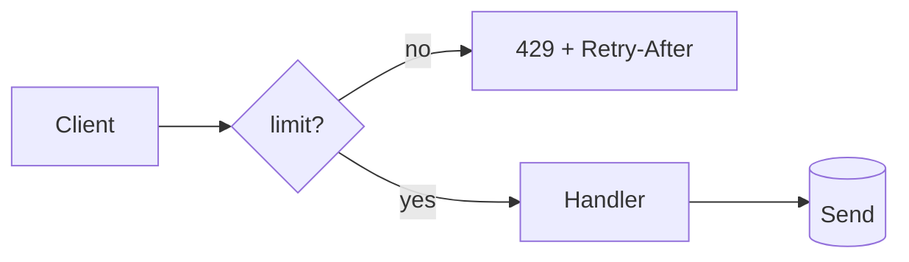

<!-- visual-shot-recap -->

# Add per-token rate limiting to the public API

Wraps `POST /v1/messages` in a **sliding-window limiter** keyed by API token, adds a `429` response with `Retry-After`, and surfaces the limit in the settings UI.

_Demo recap · visual-shot 0.10.0 · generated from this file_

> _risk_
> **Breaking-ish**
>
> Clients that burst above 60 rpm now receive `429` instead of being queued. The limit is per token and configurable per plan.

**Files changed**

| | File | Note |
| --- | --- | --- |
| A | server/rate-limit.ts | sliding-window limiter |
| M | server/routes/messages.ts | gate the handler |
| M | server/schema.ts | add token_rpm column |
| D | server/legacy-limiter.ts |  |
| R | web/Settings.tsx | from SettingsPage.tsx |

**Before**

_Interactive wireframe “Settings had no rate-limit control.” — see the rendered report._

**After**

_Interactive wireframe “A rate-limit field with the plan default.” — see the rendered report._

<details>
<summary>server/routes/messages.ts — Gate the handler and return 429 with Retry-After.</summary>

```diff
 export async function postMessages(req, res) {
   const body = await req.json();
+  const decision = await limit(req.token, body.model);
+  if (!decision.allowed) {
+    res.setHeader('Retry-After', decision.retryAfter);
+    return res.status(429).json({ error: 'rate_limited' });
+  }
   return sendMessages(body);
 }
```

- **Gate** Line 3: Check before doing any model work.
- Line 5-6: Tell clients when to retry.

</details>

**server/rate-limit.ts**

<details>
<summary>server/rate-limit.ts</summary>

```ts
export async function limit(token, model) {
  const key = `rl:${token}:${model}`;
  const now = Date.now();
  const hits = await store.zRangeByScore(key, now - WINDOW, now);
  const allowed = hits.length < rpmFor(model);
  if (allowed) await store.zAdd(key, now, `${now}`);
  return { allowed, retryAfter: Math.ceil(WINDOW / 1000) };
}
```

- **Key** Line 2: Per token and model.
- Line 4-6: Sliding window over recent hits.

</details>

**429 response**

<details>
<summary>POST /v1/messages → 429</summary>

```json
{
  "error": "rate_limited",
  "limit": 60,
  "remaining": 0,
  "retry_after": 12
}
```

</details>

### tokens

| Field | Type | Keys | Change |
| --- | --- | --- | --- |
| id | uuid | PK |  |
| token_rpm — requests per minute | integer |  | added |
| plan (was varchar(32)) | text |  | modified |

### rate_limit_hits

| Field | Type | Keys | Change |
| --- | --- | --- | --- |
| token_id | uuid | FK → tokens.id |  |
| at | timestamptz |  |  |

_Relations: rate_limit_hits → tokens (n-1)_

### `POST /v1/messages`

Returns 429 when the token exceeds its per-minute limit.

| Name | In | Type | Required | Change/Notes |
| --- | --- | --- | --- | --- |
| model | body | string | yes | modified (was model_id) |
| stream | body | boolean |  | added |

| Status | Description | Example | Change |
| --- | --- | --- | --- |
| 200 | OK | {"id":"msg_1"} |  |
| 429 | Rate limited | {"error":"rate_limited"} | added |

### `DELETE /v1/legacy/messages/{id}`



_Request flow after the change._

- [x] Regression test covers the 429 path
- [ ] Docs mention `Retry-After` — still pending
